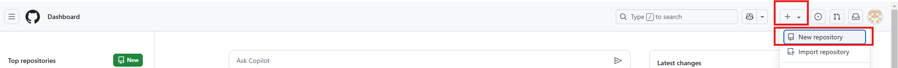
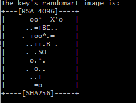
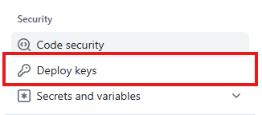
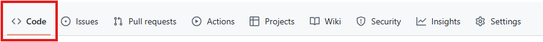
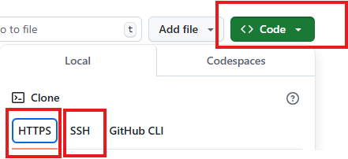
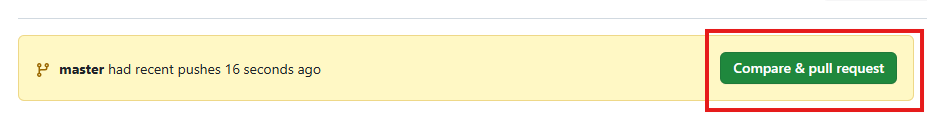

# GitHub实践文档

## 一、新建储存库


填写仓库名、公有私有以及是否需要readme文件和ignore文件等信息后 create repository 创建仓库

## 二、部署SSH密钥

### 1、生成新的SSH密钥

在你的本地机器上，打开终端或命令行工具，运行以下命令生成新的SSH密钥对：

```bash
ssh-keygen -t rsa -b 4096 -C "your_email@example.com"
```

- `-t rsa`：指定密钥类型为RSA。

- `-b 4096`：指定密钥长度为4096位。

- `-C "your_email@example.com"`：添加一个注释，通常是你的邮箱地址。

- 按提示操作，可以选择默认路径保存密钥（通常是`~/.ssh/id_rsa`），也可以指定一个自定义路径。

  

显示该画面则证明生成密钥成功

生成完成后，会得到两个文件：

- **公钥文件**（如`id_rsa.pub`）：用于添加到GitHub仓库。
- **私钥文件**（如`id_rsa`）：用于本地或服务器上进行身份验证。

### 2、将公钥添加到GitHub仓库

1. 登录到GitHub，进入你的仓库页面。点击仓库页面右上角的 **“Settings”**（设置）。

   

2. 在左侧菜单中，点击 **“Deploy keys”**（部署密钥）。

   

3. 点击 **“Add deploy key”**（添加部署密钥）。

4. 在 **“Title”** 框中输入一个描述性的标题，例如“Deployment for Key CI/CD”。

5. 在 **“Key”** 框中，粘贴你的公钥内容。你可以通过以下命令获取公钥内容：

   ```bash
   cat ~/.ssh/id_rsa.pub
   ```

   或者，如果你的公钥文件路径不同，请替换为实际路径。

6. 根据需要，勾选 **“Allow write access”**（允许写权限）。默认情况下，部署密钥只有读权限。需勾选否则无法将更改推送到远程仓库。

7. 点击 **“Add key”** 完成添加。

### 3、添加私钥到ssh-agent

在你的本地机器或服务器上，运行以下命令将私钥添加到ssh-agent：

```bash
eval "$(ssh-agent -s)"
ssh-add ~/.ssh/id_rsa
```

- 如果你的私钥文件路径不是默认的`~/.ssh/id_rsa`，请替换为实际路径。

### 4、配置SSH客户端

为了确保SSH客户端使用正确的密钥连接到GitHub，你可以在`~/.ssh/config`文件中添加以下配置：

```bash
Host github.com
  HostName.com github
  User git
  IdentityFile ~/.ssh/id_rsa
```

- 将`~/.ssh/id_rsa`替换为你的私钥文件路径。
- 如果你有多个仓库需要使用不同的密钥，可以通过`Host`字段区分。

### 5、测试SSH连接

在终端或命令行工具中运行以下命令测试SSH连接是否成功：

```bash
ssh -T git@github.com
```

如果连接成功，你会看到类似以下的消息：

```
Hi username! You've successfully authenticated, but GitHub does not provide shell access.
```

这表明部署密钥已经正确配置。

## 三、克隆仓库

#### （1）克隆仓库到本地

如果要将GitHub中仓库中的文件或代码进行克隆到本地，则可以使用以下命令：

```bash
git clone git@github.com:your-username/your-repo-name.git
git clone https://github.com/your-username/your-repo-name.git
```

git clone后面的内容在仓库页面左上角**“Code”**（代码） ---> **“<>Code”**按钮下 ---> 任选HTTPS或SSH两种方式






#### （2）将本地文件上传到指定仓库里

1. ##### 进入项目目录

2. ##### 初始化Git仓库

   ```bash
   git init
   ```

3. ##### 添加文件到暂存区

   1. 添加所有文件到暂存区：

      ```bash
      git add .
      ```

   2. 如果只想添加特定文件，可以使用：

      ```bash
      git add filename
      ```

4. ##### 提交更改

   ```bash
   git commit -m "描述信息"
   ```

5. ##### 将本地仓库与远程仓库关联

   1. 在终端中运行以下命令，将本地仓库与远程仓库关联：

      ```bash
      git remote add origin https://github.com/your-username/your-repo-name.git
      ```

   2. 如果使用SSH，命令如下：

      ```bash
      git remote add origin git@github.com:your-username/your-repo-name.git
      ```

   3. 查看当前远程仓库：

      ```bash
      git remote -v
      ```

   4. 如果地址错误，可以移除并重新添加：

      ```bash
      git remote remove origin
      然后重新执行1. 或 2. 的命令
      ```

      

6. ##### 推送代码到GitHub

   1. 推送代码到远程仓库的**main**分支：

      ```bash
      git push -u origin main
      ```

   2. 如果你的默认分支是**master**，将**main**替换成**master**

7. ##### 验证上传

   1. 打开GitHub，进入你的仓库页面，确认文件已经成功上传。

8. ##### 常见问题

   1. ##### 如果远程仓库已有文件

      如果远程仓库已有文件（例如 **README.md** 或 **.gitignore**），需要先拉取远程更改：

      ```bash
      git pull origin main --allow-unrelated-histories
      ```

      如果你的默认分支是**master**，将**main**替换成**master**

      **：wq**退出Vim模式，然后解决冲突（如果有），再推送：

      ```bash
      git push -u origin main
      ```

      如果你的默认分支是**master**，将**main**替换成**master**

   2. ##### 如果提示权限错误

      - 确保使用的是正确的HTTPS或SSH地址。
      - 如果使用的是SSH密钥，确保你的SSH密钥已经成功添加到GitHub上。

## 四、在GitHub上合并代码

点击仓库页面右上角的 **“Code”**（代码） ---> **Compare & pull request** --->  **Create pull request**（可以在这个页面查看推送的代码和原代码的差异） ---> 按照指引进行冲突的合并等。




